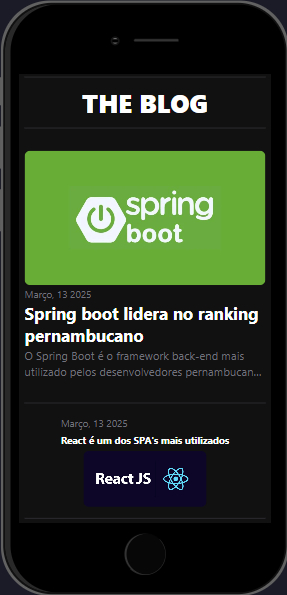

    

# Angular Blog

## 📖 Sobre o projeto  
Este é um blog de notícias sobre tecnologia, desenvolvido com Angular. O projeto utiliza dados dinâmicos para exibir conteúdos atualizados de forma interativa e responsiva.

## 📱 Exemplo em tela mobile  

    

## 🖥️ Exemplo em tela desktop 

    

<h2 id="colab">🤝 Colaborador</h2>
<table>
  <tr>
    <td align="center">
      <a href="#">
         
        
          <b>Danilo Fernandes</b>
        
      </a>
    </td>
  </tr>
</table>
